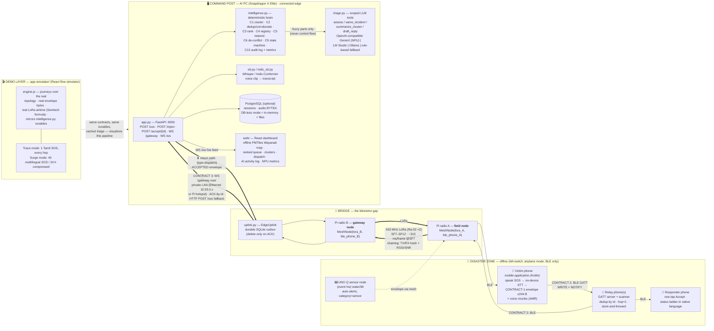
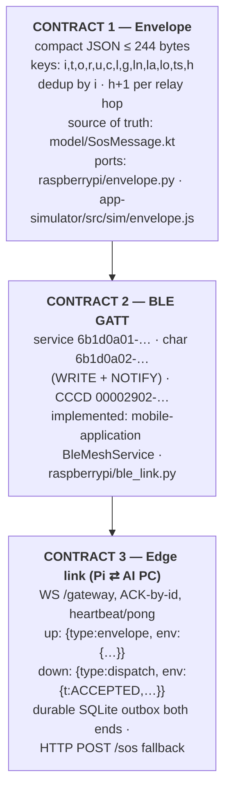
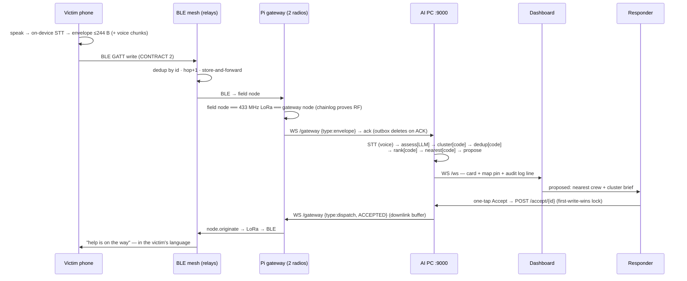
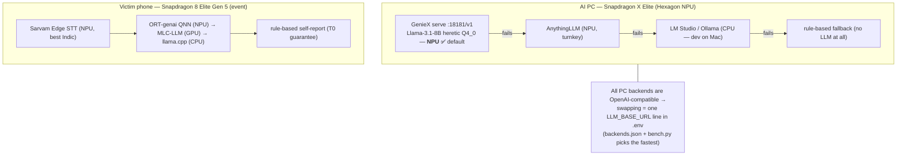
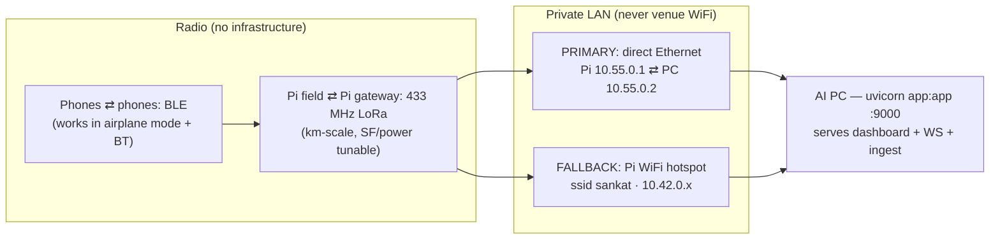

# Sankat-Mochan — Single System Architecture

> One picture of everything in this repo: the Android BLE mesh app (`mobile-application/`),
> the Pi LoRa gateway (`raspberrypi/`), the AI-PC command post (`backend/`),
> and the flow simulator (`app-simulator/`) — plus the frozen wire contracts that glue them.
> Use the Mermaid blocks directly (GitHub / Obsidian / mermaid.live render them),
> or use this doc as the source spec for a drawn (Figma/Excalidraw) diagram.

---

## 0. The one-line story

```
victim speaks → phone transcribes + compresses on-device → BLE mesh hops phone-to-phone
→ LoRa bridges the kilometre gap → Pi gateway → private LAN → AI PC command post
(NPU LLM: triage + Indic→English translate; STT) → ranked triage board → dispatch nearest
responder → return path back through the same chain → victim hears "help is on the way"
in their own language. No towers. No internet. Nothing leaves the mesh.
```

---

## 1. Master diagram (all tiers, both directions)



---

## 2. The four sub-projects at a glance

| Tier | Path | Runtime | Role |
|---|---|---|---|
| **Field mesh** | `mobile-application/` | Native Android (Kotlin, Compose) | One app, 3 roles (Victim / Responder / Relay). Every phone is a full BLE mesh node: GATT server **and** scanner, dedup + store-and-forward, optional GPS, voice SOS recording + chunking, victim status ladder, LoRa-only toggle, offline map tiles. |
| **Bridge** | `raspberrypi/` | Raspberry Pi (Python) | Two Ra-02 LoRa radios as **two isolated `MeshNode`s** (field + gateway) — the only edge between them is RF, provable via `chainlog.py` (payload hash on TX radio + RX radio + real RSSI/SNR). BLE central (`bleak`) toward phones; `uplink.py` durable outbox toward the AI PC. |
| **Command post** | `backend/` | FastAPI + React (Mac dev → Snapdragon X Elite at event) | Ingest + dedup, deterministic intelligence services (cluster/rank/dispatch/de-conflict/audit), backend-agnostic LLM triage + translation (NPU via GenieX), Whisper/Indic-Conformer STT, live WebSocket dashboard on an offline basemap, session persistence. |
| **Demo layer** | `app-simulator/` | Standalone React (Vite) | Plays the whole flow on the real Wayanad basemap. Honest simulation: real envelope wire format + 244-byte budget, real LoRa airtime math, roster/tunables copied from `intelligence.py`, cached triage per the SIMULATION-DEMO decision. Trace + Surge modes. |

---

## 3. The three frozen contracts (the glue)



Same validate → dedup → forward semantics on **every** tier (phone, Pi, PC) — that's
what lets a transport swap (e.g. radio A moving to the UNO Q) change nothing above it.

---

## 4. End-to-end sequence (SOS out, help back)



---

## 5. Inside the command post brain (C1–C18)

Governing rule (LOCKED): **deterministic code owns orchestration, state, and every
commit; the LLM is a scoped tool for fuzzy judgments only** — it never selects a
responder, emits coordinates, or drives control flow. SOS text is always wrapped
as data (prompt-injection structural defense, C12).

```mermaid
flowchart LR
    IN["envelope in<br/>(WS /gateway · POST /sos · /inject)"] --> VAL["validate + clamp<br/>(untrusted input, rule 8)"]
    VAL --> STT2["voice? → STT<br/>Whisper / Indic-Conformer"]
    STT2 --> AS["assess ⚙️LLM<br/>urgency · category ·<br/>English translation · confidence<br/>(fallback: rule-based)"]
    AS --> CL["C1 geo-cluster [code]<br/>union-find, eps≈100 m,<br/>split-biased, 2 lanes (GPS / no-GPS)"]
    CL --> DD["C2 dedup + corroborate [code]<br/>same-source merge · cross-source boost<br/>(+ same_incident ⚙️LLM confirm)"]
    DD --> RK["C3 rank [code]<br/>severity tier first · FIFO +<br/>bounded aging · corroboration boost"]
    RK --> NR["C5 nearest responder [code]<br/>greedy-by-priority · haversine ETA ·<br/>C4 registry (staleness, capacity=1)"]
    NR --> PR["propose + summarize_cluster ⚙️LLM<br/>→ responder Accept (human in the loop)"]
    PR --> DC["C6 de-conflict lock [code]<br/>first-write-wins · re-open on<br/>stuck timeout (C4/C18 watchdog)"]
    DC --> RPY["draft_reply ⚙️LLM<br/>native-language, honest, plain text"]
    RPY --> OUT["dispatch down the return path"]
    VAL -.-> AUD["C13 audit log + metrics<br/>append-only 'why' per decision ·<br/>per-stage latency · NPU tok/s"]
    AS -.-> AUD
    CL -.-> AUD
    RK -.-> AUD
    DC -.-> AUD
```



- Implemented today (`intelligence.py`): C1–C9 + C13 at demo scale, in-memory.
- LLM tool family (C10): `assess`, `same_incident`, `summarize_cluster`, `draft_reply` —
  forced JSON, data-tag wrapping, clamped outputs, per-call timeout, cached per SOS.
- Expansion drafted (C14–C18): needs extraction, gazetteer location resolution,
  reunification, resource-aware dispatch (offline routing), proactive watchdog.
  See `docs/INTELLIGENCE-DESIGN.md`.

---

## 6. AI runtime ladder (why "Snapdragon" is in the title)



Key point for the diagram: **the pipeline is backend-agnostic**; the NPU is a
plug-in accelerator, not a dependency. Every AI stage has a graceful fallback,
down to fully rule-based — the SOS always gets through.

---

## 7. Network / deployment view (event day, fully offline)



Loss protection stack (no SOS ever lost): durable SQLite outbox on both ends of
the edge link → delete only on ACK → auto-reconnect with backoff → HTTP fallback
→ two independent physical links → idempotent dedup-by-id makes replays safe.

---

## 8. Where the simulator fits (honest by construction)

The sim is **a driver + playback UI on top of the real design, not a parallel fake**:

| Sim element | Real counterpart it reuses |
|---|---|
| `app-simulator/src/sim/envelope.js` | CONTRACT-1 short-key wire format + 244-byte budget (`SosMessage.kt` / `envelope.py`) |
| LoRa hop timing | Semtech airtime formula (SF9/BW125 ≈ 1.2 s per full envelope) |
| Cluster / rank / dispatch tunables | Copied 1:1 from `backend/intelligence.py` (eps 100 m, aging cap 0.5, 12 km/h ETA…) |
| Wayanad basemap | The same offline PMTiles extract the command post serves (`copy-assets.mjs`) |
| Triage outputs | Pre-computed/cached per the SIMULATION-DEMO hybrid decision — with one **live** SOS dropped mid-demo through the real NPU to prove it's not a recording |

Two modes = the two halves of the pitch: **Trace** (one Tamil SOS, every hop
visible, incl. a lost voice chunk repaired by NACK) proves the plumbing;
**Surge** (40 multilingual SOS over a compressed 24 h) proves scale + the AI's
decisions — clustering, ranked dispatch, de-confliction, staffing pressure.

---

## 9. Cheat-sheet for the diagram author

If you're redrawing this as one poster-style diagram, the load-bearing elements are:

1. **Four vertical tiers, left → right:** Disaster zone (phones) → Bridge (LoRa/Pi) → Command post (AI PC) → Screens (dashboard + sim).
2. **Two arrows through every tier:** SOS **up** and dispatch/“help is coming” **down** — the return path is a differentiator, draw it explicitly.
3. **Three contract badges** on the seams: CONTRACT 1 (envelope) everywhere, CONTRACT 2 (BLE) phone⇄phone and phone⇄Pi, CONTRACT 3 (WS /gateway + ACK) Pi⇄PC.
4. **One "code owns control flow, LLM answers scoped questions" callout** on the command post — it's the safety story and the judges' explainability story.
5. **The kill-switch beat:** airplane mode ON, Bluetooth only — the SOS still crosses. Mark where each radio survives that.
6. **Provability details** worth a footnote: chainlog RF proof (hash + RSSI/SNR across two radios), durable ACK outbox, audit log "why" per decision, NPU tok/s metrics panel.

Source docs for deeper detail: `PLAN.md` (hardware + day plan) ·
`docs/INTELLIGENCE-DESIGN.md` (C1–C18) · `docs/EDGE-LINK.md` (CONTRACT 3) ·
`docs/HANDOFF-AIPC.md` (X Elite / GenieX setup) · `raspberrypi/README.md` (LoRa proof) ·
`app-simulator/README.md` (demo layer).
