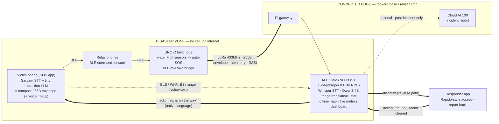

# DESIGN — Sankat-Mochan end-to-end (refined 8 July 2026)

> The confirmed system flow, after user-by-user analysis + the "does it show our app working better?"
> reframe. Companion to BRAINSTORM.md (strategy), VERIFIED-FACTS.md (evidence), MODEL-RESEARCH.md (AI stack).

---

## 0. Where the command post actually sits (verified)

Real disaster response puts the **Command & Control Centre at the nearest CONNECTED town**, not in
the network-dead disaster site — e.g. Wayanad 2024, the Army ran C&C from **Kozhikode** while the
disaster zone (Mundakkai/Chooralmala) was cut off. Forward teams push into the dead zone; NDRF
carries satellite comms + mobile command units because the site has no network.
Sources: PIB (Army Wayanad), NDRF.

**Implication:** our AI PC command post sits at that connected edge (forward base / relief camp).
**Our mesh + LoRa is what extends coordination INTO the network-dead zone** where victims and first
responders are. That's the exact gap NDRF fills today with expensive satellite kit — we're the
cheap, dense, last-mile version.

---

## 0.5 Architecture diagram (canonical — source of truth for the deck)



**Reading it:** intelligence at every hop — phone (STT + extraction), UNO Q (autonomous sensing),
command post (triage/translate/cluster/dispatch). Voice crosses only where BLE/Wi-Fi reaches the
command post (Case A); everything crossing LoRa is the compact text envelope (Case B). The heavy
arrows are the live rescue path; the dashed Cloud AI 100 is off the critical path. The reverse
arrows (dispatch → responder, ack → victim) are the bidirectional loop = the orchestration story.

## 1. The three apps / nodes

1. **Victim app** — one-tap SOS + optional voice; shows honest status; offline first-aid chatbot (stretch).
2. **First-responder app** — Rapido-captain-style: pops up nearby victims, tap to ACCEPT, report back.
3. **AI PC command post** — Whisper STT + Qwen3-4B triage/translate/cluster/allocate + offline map + dispatch.
Transport for all: **BLE phone-mesh (store-and-forward) + LoRa long-range bridge (via UNO Q ↔ Pi).**

---

## 2. Forward path (SOS → responder)

```
[VICTIM app]  one-tap SOS (+ voice if recorded); auto-capture GPS, battery, time, language
     │  status: "Sending…"
     ▼
[BLE mesh]  hops phone→phone (store-and-forward)
     │
     ├── Case A: unbroken BLE/Wi-Fi path to the command post
     │        → VOICE travels (compressed/chunked) → Whisper on AI PC transcribes
     │
     └── Case B: path must cross the long-range LoRa bridge
              → TEXT-ONLY compact SOS (≤255 B): category + location + short note
              → (voice cannot cross LoRa — physics; ~250× too big)
     ▼
[UNO Q + LoRa]  (Case B) 255-byte envelope, SF-tuned, ack+retry, RSSI logged
     ▼
[Pi gateway → AI PC command post]
     │  status back to victim: "Message reached the control room" (in native language)
     ▼
[AI PC agent]  transcribe (Case A) → triage (urgency+category, explainable) → translate
     │          → cluster/dedup → plot on offline map → allocate to nearest responder
     ▼
[FIRST-RESPONDER app]  pop-up: nearby victim, urgency, location, gist  (Rapido-style)
     │  responder taps ACCEPT
     ▼
[AI PC]  → relays to victim: "Help is on the way" (native language)
```

## 3. Return path (the bidirectional loop — one mechanism, three payoffs)

- **Responder → command post:** ACCEPT, "cleared/in-progress" (de-confliction with other teams),
  "victim found" report (responder's own clean voice → easy STT, precise GPS).
- **Command post → victim:** ack + status in native language; responder can push an instruction
  ("move to higher ground," "we're 10 min away") → AI PC translates → victim's phone.
- Serves responder tasking + coordinator capacity-tracking + victim reassurance, built once.

## 4. Victim status UX (native language, honest)

`Sending…` → `Message reached the control room` → `Help is on the way` (on responder ACCEPT)
→ live instructions from responders as they arrive. Never a false promise; if it can't confirm,
it stays honest ("still trying to reach a device nearby").

---

## 5. STT placement — DECIDED (updated: STT + text-LLM, never audio-LLM)

**Do NOT use a voice-in "omni" LLM anywhere.** Phi-4-multimodal has no Indic (8 langs); Qwen3-Omni is
a 3B+ MoE, not AI-Hub-precompiled → high 24h risk. The clean, reliable split is **STT (speech→text)
+ a text LLM (Qwen3-4B) that reasons over the text.**

- **AI PC (Case A / BLE path + all triage):** voice arrives via BLE → **Whisper (AI Hub, precompiled
  w8a16 for 8 Elite Gen 5)** or Sarvam → Qwen3-4B triage/translate/cluster/compress.
- **Phone (first-stage processor — ALWAYS):** a panicked victim rambles; the transcript is NOT
  reliably short and must NOT be blindly truncated (the key fact may be at the end). So the phone
  does **Sarvam Edge STT → small extraction LLM (e.g. Qwen3-0.6B, on AI Hub) → structured ≤255 B
  envelope** `{urgency, category, location-hint, short-gist}` (structured extraction, NOT free
  summary — more reliable on a tiny model). This compact envelope ALWAYS goes out (fits LoRa + BLE).
  **Bonus (Case A only):** if a BLE path to the command post exists, the phone ALSO sends the full
  audio/transcript so the AI PC can hear the real voice and re-triage richer.
  **T0/T1 split:** on-phone extraction LLM = T1; the T0 guarantee is STT + first-255-bytes +
  one-tap urgency category, so the demo works even if the phone LLM isn't stable by Sunday.
- Judge one-liner (unchanged): *"Voice works within the phone mesh that reaches the command post; the
  long-range LoRa bridge carries a compact text SOS."* Demo both cases.
- Caveat to acknowledge: Sarvam Edge needs a flagship NPU (fine for OnePlus 15; a real deployment limit).

---

## 6. Stretch feature — offline first-aid chatbot on the victim phone

- **What:** small offline LLM on the phone NPU answering "what do I do right now" (signal for help,
  stop bleeding, purify water, brace for aftershock), with visual cards.
- **Why it fits:** reinforces offline/edge theme + phone-as-inference-node (multi-device) + real usefulness when cut off.
- **STRICT guardrails:** build ONLY after the core loop is done + rehearsed 3× (hour 20+, like the
  Cloud AI 100 report). Keep RAG TINY and pre-baked — ~10–20 curated first-aid cards (text + one
  image each), retrieved by the LLM. Do NOT build a general image-RAG corpus (24h trap). It's an
  "and one more thing" closer, never a core pillar. Must not steal focus from the SOS→triage→dispatch loop.

---

## 7. Scope tiers (what to build in what order)

- **T0 core (must work, rehearsed 3×):** victim one-tap SOS + status; BLE one hop; UNO Q + one LoRa hop (kill-switch); AI PC Whisper+triage+translate+map with live latency; responder app ACCEPT; ack back to victim. Instrumentation from hour 1.
- **T1 depth (high-value):** clustering/dedup; sensor-fusion corroboration (UNO Q auto-alert); de-confliction between responders; native-language responder→victim instructions.
- **T2 stretch (only if green):** offline first-aid chatbot + tiny image-card RAG; Cloud AI 100 post-incident report.
